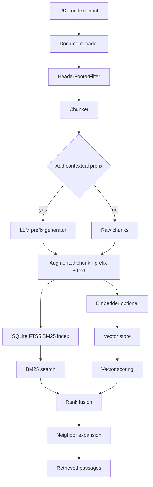

# Folio

Folio is a zero‑config retrieval engine for iOS and macOS.  
It ingests PDFs and text, strips headers/footers, chunks content, and indexes it into SQLite with **BM25 (FTS5)**.

It also supports **Anthropic‑style contextual retrieval**:
- LLM‑generated **one‑line prefixes** per chunk (using Folio’s prompt templates)
- Optional **contextual embeddings** (e.g., EmbeddingGemma, LLaMA)
- **Hybrid search**: BM25 + vectors with rank fusion
- **Neighbor expansion**: join ± adjacent chunks for coherent RAG passages

---

## Installation — Swift Package Manager

### Xcode
1. **File → Add Packages…**
2. Enter: `https://github.com/lolbigtime/Folio`
3. Add the **Folio** product to your app target.

> **Note:** SPM resources are already configured. Make sure your app bundles the package resources (the SQL migration files) automatically. No extra steps needed in most projects.

### `Package.swift` (if integrating programmatically)
```swift
// In your app’s Package.swift
.dependencies = [
    .package(url: "https://github.com/lolbigtime/Folio", .upToNextMinor(from: "0.1.0"))
]
// In your target:
.product(name: "Folio", package: "Folio")
```

---

## Pipeline



---

## Quick Start

### Basic BM25
```swift
import Folio

let folio = try FolioEngine()
try folio.ingest(.text("hello world from folio", name: "note.txt"), sourceId: "T1")

let hits = try folio.search("hello", in: "T1", limit: 5)
for h in hits {
    print("• \(h.sourceId): \(h.excerpt)")
}
```

### Contextual prefixes with an LLM
```swift
var cfg = FolioConfig()
cfg.indexing.useContextualPrefix = true
cfg.indexing.contextFn = { doc, page, chunk in
    let prompt = LLMPrefixPrompter.build(ChunkContext(
        docName: doc.name,
        pageIndex: page.index,
        sectionHeader: page.header,
        chunkText: chunk
    ))
    let raw = try await MyLocalLLM.generate(
        prompt: prompt,
        maxTokens: LLMPrefixPrompter.maxOutputTokens,
        temperature: 0.2,
        stop: LLMPrefixPrompter.stop
    )
    return LLMPrefixPrompter.sanitize(raw)
}

let folio = try FolioEngine()
_ = try await folio.ingestAsync(.pdf(pdfURL), sourceId: "Doc1", config: cfg)
```

### Hybrid retrieval (BM25 + vectors + fusion + expand)
```swift
let gemma = EmbeddingGemmaEmbedder(
    configuration: .init(
        baseURL: URL(string: "http://127.0.0.1:11434")!,
        model: "gemma:2b"
    )
)

let engine = try FolioEngine(
    databaseURL: dbURL,
    loaders: [PDFDocumentLoader(), TextDocumentLoader()],
    chunker: UniversalChunker(),
    embedder: gemma
)

try engine.backfillEmbeddings() // populate vectors for cosine scoring

let results = try engine.searchHybrid("optimizer settings", in: "Doc1", limit: 5, expand: 1)
for r in results {
    print("• \(r.sourceId) p.\(r.startPage ?? 0)  [bm25=\(r.bm25), cos=\(r.cosine ?? .nan), score=\(r.score)]")
}
```

### End-to-end example (PDF + text + hybrid search + LLM answer)
```swift
import Folio
import Foundation

let gemma = EmbeddingGemmaEmbedder(
    configuration: .init(model: "gemma:2b")
)

let engine = try FolioEngine(embedder: gemma)

// Ingest different document types
try engine.ingest(.pdf(pdfURL), sourceId: "manual")
let noteText = try String(decoding: Data(contentsOf: notesURL), as: UTF8.self)
try engine.ingest(.text(noteText, name: "release-notes.txt"), sourceId: "notes")

// Make sure every chunk has a vector before hybrid search
try engine.backfillEmbeddings(batch: 96)

let passages = try engine.searchHybrid(
    "How do I configure streaming mode?",
    limit: 3,
    expand: 2
)

let context = passages
    .map { "Source: \($0.sourceId) page \($0.startPage ?? 0)\n\($0.text)" }
    .joined(separator: "\n\n---\n\n")

let client = OpenAIStyleClient() // defaults to Ollama's /v1/chat/completions on localhost

Task {
    let answer = try await client.chatCompletion(
        model: "gpt-4o-mini",
        messages: [
            .init(role: .system, content: "You are a precise technical assistant."),
            .init(
                role: .user,
                content: "Using only the provided documentation, answer: How do I configure streaming mode?\n\nContext:\n\(context)"
            )
        ],
        temperature: 0.2,
        maxTokens: 256
    ).choices.first?.message.content ?? ""

    print(answer)
}
```

---

## Using a Local LLM for Prefixes

Folio ships **prompt templates** (`LLMPrefixPrompter`, `ChunkContext`) that follow Anthropic’s cookbook.  
You can use **any** on‑device or remote LLM:

- **On device (recommended):** run a small instruction model (e.g., Gemma‑Instruct, LLaMA‑Instruct) via your preferred runtime (ggml/gguf, MLC, llama.cpp wrapper, etc.).  
- Return **one short line** (≤~80 tokens) per chunk. Folio caches it in `prefix_cache` and prepends it during indexing and embedding.

Minimal app‑side hook (already shown above):
```swift
cfg.indexing.contextFn = { doc, page, chunk in
    let prompt = LLMPrefixPrompter.build(ChunkContext(docName: doc.name, pageIndex: page.index, chunkText: chunk))
    let raw = try await MyLocalLLM.generate(prompt: prompt,
                                            maxTokens: LLMPrefixPrompter.maxOutputTokens,
                                            stop: LLMPrefixPrompter.stop)
    return LLMPrefixPrompter.sanitize(raw)
}
```

---

## Using EmbeddingGemma (or another embedder)

Folio exposes an `Embedder` protocol:

```swift
public protocol Embedder: Sendable {
    func embed(_ text: String) throws -> [Float]
    func embedBatch(_ texts: [String]) throws -> [[Float]]
}
```

To use **EmbeddingGemma** locally:
1. Install [Ollama](https://ollama.com) (or another on-device runtime) and run `ollama pull gemma:2b`.
2. Start the Ollama service (`ollama serve`), which listens on `http://127.0.0.1:11434`.
3. Initialize `EmbeddingGemmaEmbedder(configuration:)` with the model name you pulled (for example `gemma:2b`).
4. Pass the embedder into `FolioEngine(..., embedder: gemma)` and call `backfillEmbeddings` after ingest so cosine has vectors for every BM25 chunk.
5. (Optional) If you use a different runtime, conform to `Embedder` and proxy to its embedding API.

**Tip:** Embed **`prefix + chunk`** (Folio’s ingest already composes this) to get contextual embeddings.

---

## Calling OpenAI-style LLMs

`OpenAIStyleClient` wraps the `/chat/completions` API surfaced by on-device runtimes such as **Ollama** (default) as well as hoste
d providers:

```swift
let client = OpenAIStyleClient() // defaults to http://127.0.0.1:11434/v1

let completion = try await client.chatCompletion(
    model: "gpt-4o-mini",
    messages: [
        .init(role: .system, content: "You are a succinct assistant."),
        .init(role: .user, content: "Summarize this: ...")
    ],
    temperature: 0.3,
    maxTokens: 256
)

print(completion.choices.first?.message.content ?? "")
```

Use the same client for ingest-time prefix generation or final answer synthesis.

---

## Public API (high‑level)

```swift
public final class FolioEngine {
    public convenience init(loaders: [DocumentLoader]? = nil, chunker: Chunker? = nil, embedder: Embedder? = nil) throws
    public convenience init(appGroup identifier: String, loaders: [DocumentLoader]? = nil, chunker: Chunker? = nil, embedder: Embedder? = nil) throws
    public static func inMemory(loaders: [DocumentLoader]? = nil, chunker: Chunker? = nil, embedder: Embedder? = nil) throws -> FolioEngine
    public init(databaseURL: URL, loaders: [DocumentLoader], chunker: Chunker, embedder: Embedder?) throws

    @discardableResult
    public func ingest(_ input: IngestInput, sourceId: String, config: FolioConfig = .init()) throws -> (pages: Int, chunks: Int)

    @discardableResult
    public func ingestAsync(_ input: IngestInput, sourceId: String, config: FolioConfig = .init()) async throws -> (pages: Int, chunks: Int)

    public func backfillEmbeddings(for sourceId: String? = nil, batch: Int = 64) throws

    public func search(_ query: String, in sourceId: String? = nil, limit: Int = 10) throws -> [Snippet]
    public func searchWithContext(_ query: String, in sourceId: String? = nil, limit: Int = 5, expand: Int = 1) throws -> [RetrievedPassage]
    public func searchHybrid(_ query: String, in sourceId: String? = nil, limit: Int = 5, expand: Int = 1, wBM25: Double = 0.5) throws -> [RetrievedResult]

    public func deleteSource(_ sourceId: String) throws
    public func listSources() throws -> [Source]
}
```

---

## Schema / Migrations

Migrations are bundled as SPM resources and applied at runtime:

- `001_core.sql` — `sources`, `doc_chunks`
- `002_fts.sql` — `doc_chunks_fts` (FTS5 mirror)
- `003_indexes.sql` — helpful indexes
- `004_prefix_cache.sql` — `prefix_cache` for LLM prefixes
- `005_embeddings.sql` — `doc_chunk_vectors(rowid, dim, vec BLOB)`

Notes:
- `section_title` stores the prefix; FTS content receives **prefix + chunk**.
- `searchWithContext` shows prefix‑free snippets; hybrid uses the same candidates plus vectors.

---

## License

MIT
